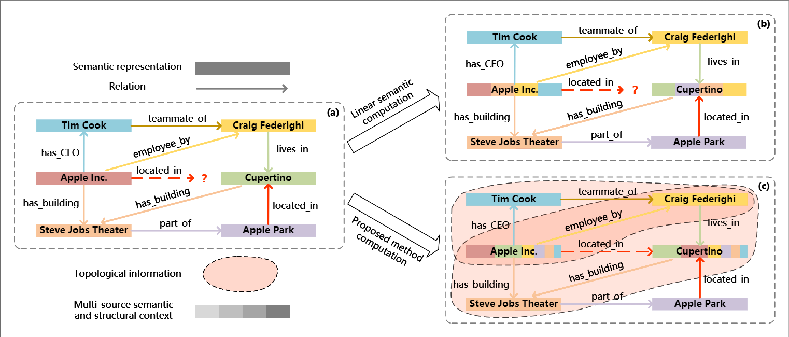
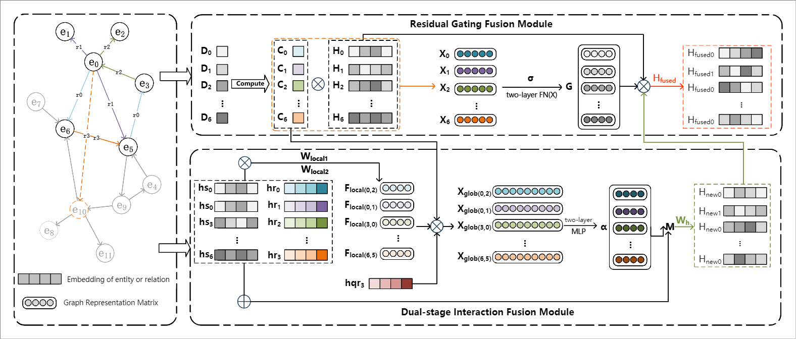

## Overview

RGDF (Residual Gated Dual-stage Fusion) is a knowledge-graph reasoning framework based on graph neural networks. It supports knowledge graph completion and link prediction tasks.

## Content

- **Multi-version**: three model implementations (v1, v2, v3)

- **Lightweight**: single gated residual connection

- **Graph structural features**: compute degree, triangles, 4-cycles, etc.

- **Attention mechanisms**: implements edge attention and node sampling

- **Structure-aware**: combines Local Interaction and Global Modulation modules

- **Multiple datasets**: WN18RR, UMLS, Family, NELL, etc.

## Version Notes

- **v1:** Dual-stage interaction fusion based on graph structure; baseline implementation.
- **v2:** Graph-enhanced residual gated fusion module; baseline implementation.
- **v3:** Combines the structure-aware mechanism and Global Modulation with the residual gated fusion module.

## Environment Requirements

- Python 3.7+
- PyTorch 1.8+
- NumPy
- SciPy
- torch-scatter
- tqdm

## Key Parameters (some items are being finalized; we’ll update soon)

* `--data_path`: dataset path
* `--epoch`: number of training epochs (default: 330)
* `--layers`: number of GNN layers (default: 8)
* `--topk`: Top-K sampling size (varies by dataset; e.g., 1000 for WN18RR)
* `--gpu`: GPU device ID (default: 0)
* `--seed`: random seed (default: 1234)
* `--tau`: temperature parameter (default: 1.0)
* `--fact_ratio`: fact ratio (default: 0.96)
* `--eval_interval`: evaluation interval (default: 30)

| Datasets | topk | layers | fact_ratio |
|--------|------|--------|------------|
| **Family** | 100 | 8 | 0.90 |
| **UMLS** | 100 | 5 | 0.90 |
| **WN18RR** | 1000 | 8 | 0.96 |
| **FB15k-237** | 2000 | 7 | 0.99 |
| **NELL995** | 2000 | 6 | 0.95 |
| **YAGO3-10** | 1000 | 8 | 0.995 |

## Contact

If you have any questions or suggestions, please reach out:

Email: 15585886266@163.com